# Documentation

This page contains all the documentation associated for the **Text adventure** project.

Please note that, due to the large size of some diagrams, sometimes you'll need to use the zoom function of your browser
of choice.

## Index of contents

Below is reported a clickable list of all the section of this page:

1) [Introduction](#Introduction) 
2) [Graphic interface and movement control](#Graphic-interface-and-movement-control) 
3) [The Game](#The-Game) 
4) [Diagrams](#Diagrams) 
5) [System Sequence Diagram](#System-Sequence-Diagram) 
6) [Internal Sequence Diagrams](#Internal-Sequence-Diagrams) 
7) [Specification Document](#Specification-Document) 
8) [Code](#Code) 
9) [System Test Document](#System-Test-Document) 
10) [Unit Test Report](#Unit-Test-Report) 
11) [Manual](#Manual) 
12) [Contributors](#Contributors) 

---

# Introduction
“Extraction” is a text adventure that comes to life from the renowned Ubisoft video game, “**Rainbow Six Extraction**”. In a world upset by an alien parasitic invasion, chaos and destruction reign supreme. You, a valiant warrior of the elite Rainbow team, have been selected for a mission of vital importance. Your task is to infiltrate a building, confront and defeat the archons that hinder your path, and save your imprisoned companion. Your mission is dangerous, but the hope of a better world rests on your shoulders.

---

# Graphic interface and movement control 
The graphic interface was created using a framework known as “Swing”.
Java Swing is a part of Java Foundation Classes (JFC) used for building graphical user interfaces (GUIs) in Java applications. It provides a set of "lightweight" (all-Java language) components that, unlike the Abstract Window Toolkit (AWT) components, do not rely on native peers (platform-specific code). Swing components are platform-independent and more flexible, offering a richer set of GUI components than AWT.

The interface displays the building’s map, highlighting the different rooms that the player can visit. At the bottom of the interface, there are four buttons: North, South, East, and West, which guide the player’s movement. If the chosen direction does not lead to a room, the movement is prevented. Each room can host an alien and a variety of objects that the player can eventually collect. All this information is displayed on the screen.

---

# The Game
The game is set in a building overrun by an alien parasite. A member of the Rainbow team has been taken hostage by these aliens, and your primary goal will be to locate and rescue him, exiting the building. During your mission, you may encounter some of these aliens, whom you will have to fight or from whom you will have to escape. If you lose all your life during a fight, the game will end.

Throughout the game, you will have the opportunity to:

- Explore various rooms where you can find useful items to collect.
- Be mindful of the number of items you can carry and the total weight you can bear. If necessary, you can remove unnecessary items from your inventory.
- Save the game at any point. From the initial menu, you will also have the option to load a previously saved game.

---
## Diagrams
In this section, the main diagrams required by the assignment are provided.

### Domain Model
The Domain Model represents the main concepts of the system and the relationships between them. It is a high-level representation of the system's structure and is used to define the scope of the system.
Here are defined the main classes of the system, such as Player, Room, Item, and Alien, their attributes, operations, and the relationships between them

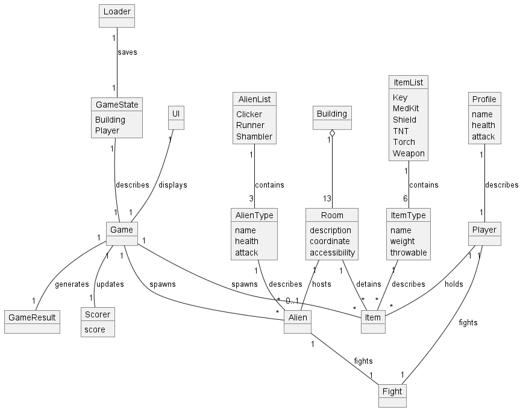

## Design class model
A Design Class Model is a detailed, structured representation of the software system's classes, interfaces, and their relationships.
For readability reasons, we decided to split the Design Class Model into thee parts: Core, Graphics, and Upload.

### Design Class Model Core
This part of the Design Class Model represents the core classes of the system, such as Player, Room, Item, Alien, and the main controller, Game.

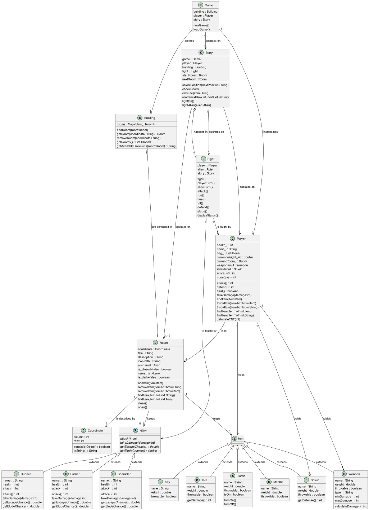

### Design Class Model Graphics
This part of the Design Class Model represents the classes related to the graphic interface.

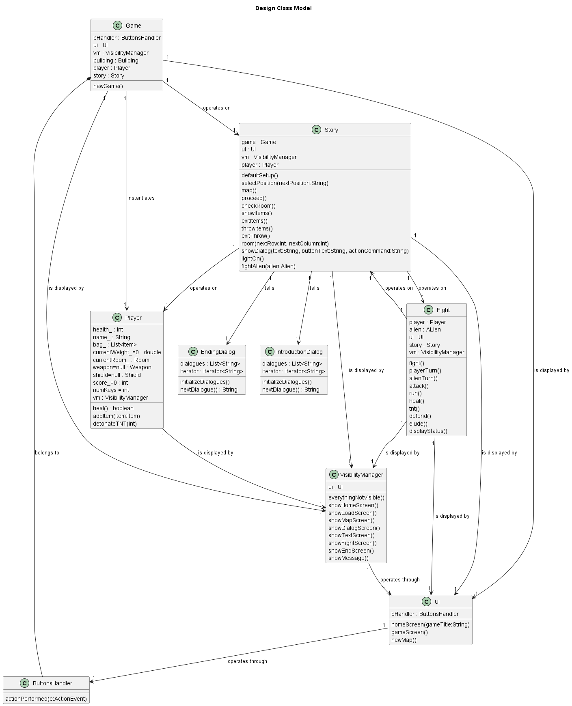

### Design-Class-Model-Upload
This part of the Design Class Model represents the classes related to the upload of the game's state.

---

## System Sequence Diagram
This diagram describes the sequence of interactions between external actors and a system for a particular scenario of a use case.

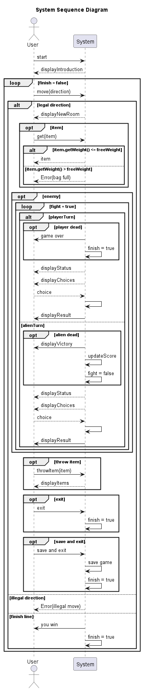

---

## Internal Sequence Diagrams
Unlike the System Sequence Diagram, the Internal Sequence Diagram describes the interactions between internal components or objects within a system for a specific scenario of a use case. Here are some of the main ISD:

### Attack
This diagram describes the sequence of interactions between the player and the alien during an attack.

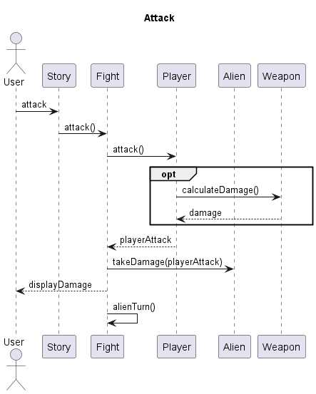

### Collect Item/Add Item
This diagram describes the sequence of interactions between the player and the item during the collection.

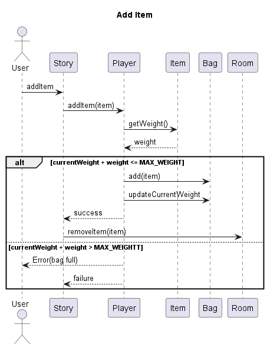

### Defend
This diagram describes the sequence of interactions between the player and the alien during a defense.

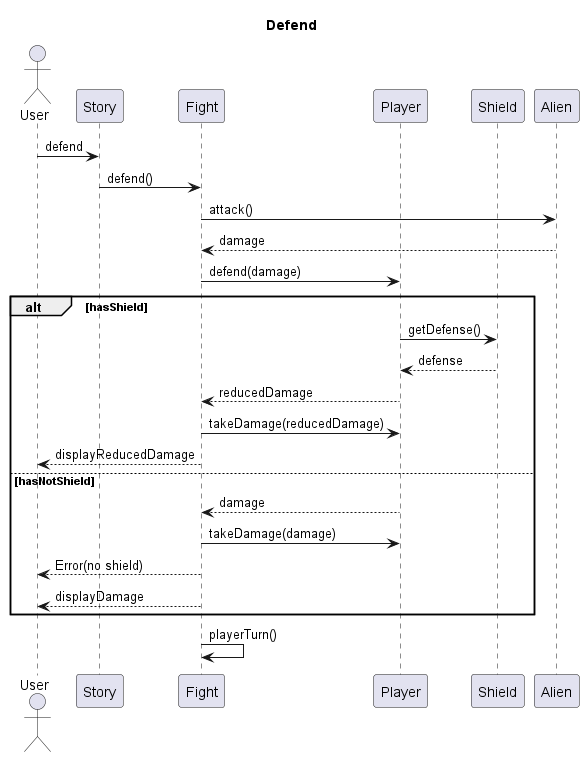

### Fight
This diagram describes the sequence of interactions between the player and the alien during a fight.

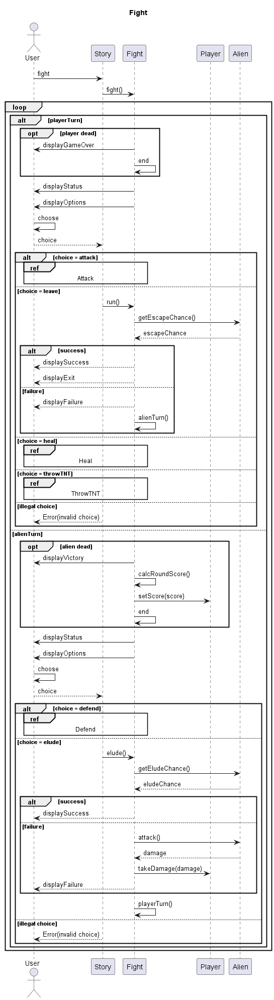

### Heal
This diagram describes the sequence of interactions between the player and the medikit during a heal.

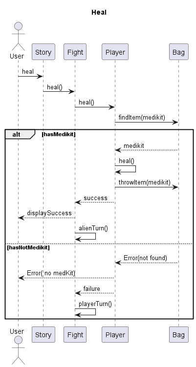

### Throw Item

This diagram describes the sequence of interactions between the player and the alien during a throw item.
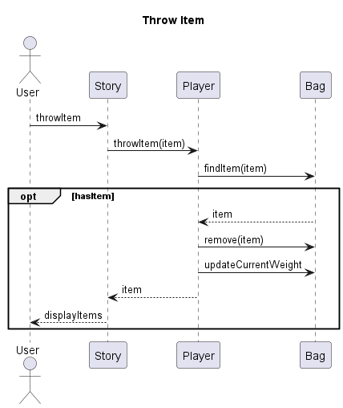

### Throw TNT
This diagram describes the sequence of interactions between the player and the alien during a throw TNT.

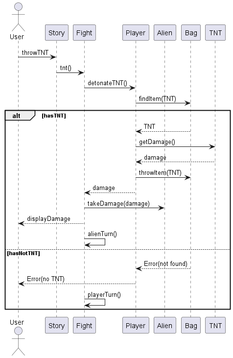

---

## Code

The entire **code** of this project is hosted on GitHub and the repository can be found at [this page](https://github.com/EDIDS/EDIDS_Proj).

[**Back to Index**](#index-of-contents)

---

## System Test Document

Here are the user stories formatted as tables:

### User Story 1: Moving to Adjacent Rooms

| **Titolo**          | Movement to Adjacent Rooms                                    |
|---------------------|---------------------------------------------------------------|
| **Summary**         | As a player, I want to be able to move to adjacent rooms, so that I can explore the map. |
| **Pre Condition**   | The player is located in a room on the map. The game is in a state where movement is allowed. |
| **Post Condition**  | The player’s position is updated if the chosen direction is accessible. An error message is displayed if the chosen direction is inaccessible. The new room is displayed if the movement is successful. |
| **Flow of Events**  | 1. Display possible directions (North, South, East, West). 2. Player chooses a direction. 3. Check if the chosen direction is accessible. 4. If the direction is inaccessible, display an error message (e.g. "Path Closed"). 5. If the direction is accessible, update the player's position (increase or decrease coordinate). 6. Display the new room if the direction is accessible. |
| **Expected result** | The game displays possible directions. The player can choose a direction and move to an adjacent room if it is accessible. An error message is displayed if the chosen direction is inaccessible. The player's position is updated correctly for accessible directions. The new room is displayed correctly after a successful move. |
| **Actual result**   | The game displays possible directions. The player can choose a direction and move to an adjacent room if it is accessible. An error message is displayed if the chosen direction is inaccessible. The player's position is updated correctly for accessible directions. The new room is displayed correctly after a successful move.                       |
| **Status**          |    **PASSED**                        |

### User Story 2: Picking Up Found Items

| **Titolo**          | Picking Up Found Items                                        |
|---------------------|---------------------------------------------------------------|
| **Summary**         | As a player, I want to be able to pick up found items, so that I can use them. |
| **Pre Condition**   | The player is in a room with one or more items available to be picked up. The player has a bag for storing items. |
| **Post Condition**  | The item is added to the player’s bag if the bag has enough free weight capacity. An error message is displayed if the item cannot be added due to weight constraints. |
| **Flow of Events**  | 1. Create a bag to contain items (e.g. List<item>). 2. Set the maximum weight the bag can endure (e.g. 100 units). 3. Keep track of the bag's current weight. 4. Retrieve the weight of the requested item (e.g. 10 units). 5. Check if the item's weight is less than or equal to the current free weight of the bag. 6. If the item’s weight is within the free weight limit, add the item to the bag. 7. If the item’s weight exceeds the free weight limit, display an error message (e.g. "Bag is already full"). |
| **Expected result** | The player can see the bag's current weight and maximum capacity. Items can be picked up and added to the bag if there is enough free weight capacity. An error message is displayed if an item cannot be added due to exceeding the weight limit. |
| **Actual result**   | The player can see the bag's current weight and maximum capacity. Items can be picked up and added to the bag if there is enough free weight capacity. An error message is displayed if an item cannot be added due to exceeding the weight limit.                        |
| **Status**          |    **PASSED**                        |

### User Story 3: Saving Game's State

| **Titolo**          | Saving Game's State                                           |
|---------------------|---------------------------------------------------------------|
| **Summary**         | As a player, I want to be able to save the game's state, so that I can reuse it later. |
| **Pre Condition**   | The player is in a playable state. The game allows saving the state. |
| **Post Condition**  | The game's state is saved in a file. The file is uploaded to a cloud service. A success message is displayed if the upload is successful. |
| **Flow of Events**  | 1. Display save button. 2. Gather game's information (e.g., Player's and Building's data). 3. Save the gathered data in a file. 4. Upload the file to a cloud service (e.g., AWS). 5. Display success message if the upload is successful. |
| **Expected result** | The player sees a save button. The game gathers and saves the required information. The saved data file is uploaded to the cloud. A success message confirms the upload. |
| **Actual result**   | The player sees a save button. The game gathers and saves the required information. The saved data file is uploaded to the cloud. A success message confirms the upload.                        |
| **Status**          |    **PASSED**                        |

### User Story 4: Attacking the Enemy

| **Titolo**          | Attacking the Enemy                                           |
|---------------------|---------------------------------------------------------------|
| **Summary**         | As a player, I want to attack the enemy, so that I can decrease its health. |
| **Pre Condition**   | The player chooses the Attack action. |
| **Post Condition**  | The enemy's health is decreased by the player's attack value. |
| **Flow of Events**  | 1. The player chooses to attack. 2. Retrieve player's attack value. 3. Decrease enemy's health by the attack value (e.g., attack = 30, enemy's health 50 -> 20). |
| **Expected result** | The enemy's health decreases according to the player's attack value. |
| **Actual result**   | The enemy's health decreases according to the player's attack value.                         |
| **Status**          |    **PASSED**                        |

### User Story 5: Defending Against an Attack

| **Titolo**          | Defending Against an Attack                                   |
|---------------------|---------------------------------------------------------------|
| **Summary**         | As a player, I want to defend against an enemy attack, so that I can reduce the damage taken. |
| **Pre Condition**   | The player chooses the Defend action. |
| **Post Condition**  | The player's health decreases based on the enemy's attack minus the player's defense. |
| **Flow of Events**  | 1. The player chooses to defend. 2. Retrieve enemy's attack value and player's defense value. 3. Decrease enemy's attack by player's defense and decrease player's health by the resulting value (e.g., enemy's attack = 20, defense = 10 -> health 100 -> 90). |
| **Expected result** | The player's health decreases by the reduced damage amount. |
| **Actual result**   | The player's health decreases by the reduced damage amount.                        |
| **Status**          |    **PASSED**                        |

### User Story 6: Curing with a Medkit

| **Titolo**          | Curing with a Medikit                                                                                                                                                                                                        |
| ------------------- | ---------------------------------------------------------------------------------------------------------------------------------------------------------------------------------------------------------------------------- |
| **Summary**         | As a player, I want to use a medkit to restore my health to its maximum value.                                                                                                                                               |
| **Pre Condition**   | The player chooses the Cure action. The player has a medikit in the bag.                                                                                                                                                  |
| **Post Condition**  | The player's health is restored to its maximum value if a medikit is found. An error message is displayed if no medikit is found.                                                                                         |
| **Flow of Events**  | 1. The player chooses to cure. 2. Search the bag for a medikit. 3. If a medikit is found, set player's health to its maximum value. 4. If no medikit is found, display an error message (e.g., "No medikit found"). |
| **Expected result** | The player's health is restored to its maximum value if a medikit is found. An error message is displayed if no medikit is found.                                                                                         |
| **Actual result**   | The player's health is restored to its maximum value if a medikit is found. An error message is displayed if no medikit is found.                                                                                                                                                                                        |
| **Status**          |    **PASSED**                        |

### User Story 7: Updating Player's Score

| **Titolo**          | Updating Player's Score                                       |
|---------------------|---------------------------------------------------------------|
| **Summary**         | As a player, I want my score to be updated based on the combat, so that I can see my progress. |
| **Pre Condition**   | The combat has ended. |
| **Post Condition**  | The player's score is updated based on the combat results. |
| **Flow of Events**  | 1. The combat ends. 2. Compute the score based on the fight's data. 3. Update the player's score. |
| **Expected result** | The player's score is updated based on the combat results. |
| **Actual result**   | The player's score is updated based on the combat results.                        |
| **Status**          |    **PASSED**                        |

### User Story 8: Loading Previous Games

| **Titolo**          | Loading Previous Games                                        |
|---------------------|---------------------------------------------------------------|
| **Summary**         | As a player, I want to be able to load previous games, so that I can restart playing them. |
| **Pre Condition**   | The player is in the game interface. There are saved game files available. |
| **Post Condition**  | The chosen game's data is loaded and the game resumes from the saved state. |
| **Flow of Events**  | 1. Display load button. 2. Show a list of saved games. 3. Get the chosen game's data. 4. Load the game's data. 5. Display success message if the load is successful. |
| **Expected result** | The game loads the chosen saved state and a success message is displayed. |
| **Actual result**   | The game loads the chosen saved state and a success message is displayed.   |
| **Status**          |    **PASSED**                        |

[**Back to Index**](#index-of-contents)

---

## Unit Test Report

The auto-generated JUnit test report can be found at [this page](/resources/UnitTestReport/surefire-report.html).

[**Back to Index**](#index-of-contents)

---

## Manual

If you want to consult the **Manual** click [here](manual.md). 

[**Back to Index**](#index-of-contents)

---

## Contributors

This project was carried out by:

|     **Name**      | **Badge** |
| :---------------: | --------- |
| Alessandro Vulcu  | 2041835   |
|  Gabriele Zolla   |  2066629  |
| Giorgio Prizzon | 2066587   |
| Gabriele Posenato |   2066668   |

[**Back to Index**](#index-of-contents)
