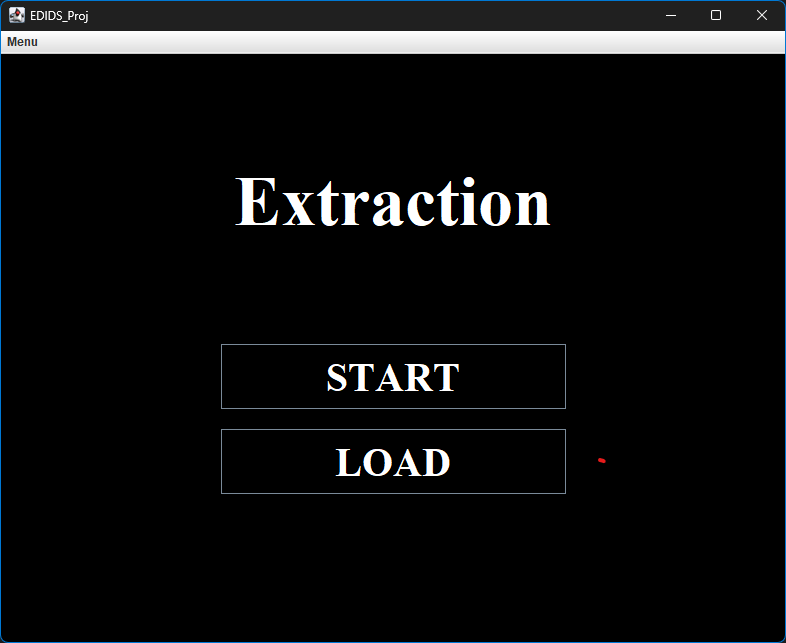
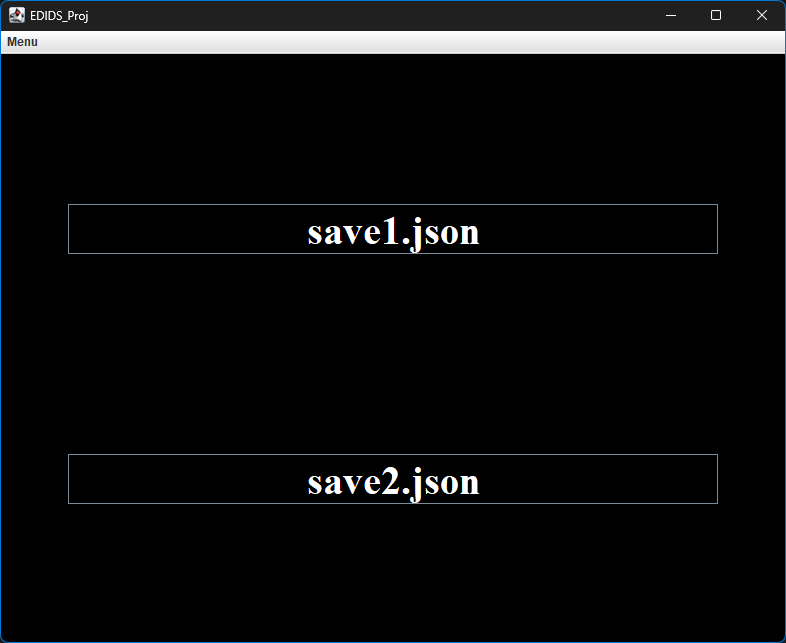
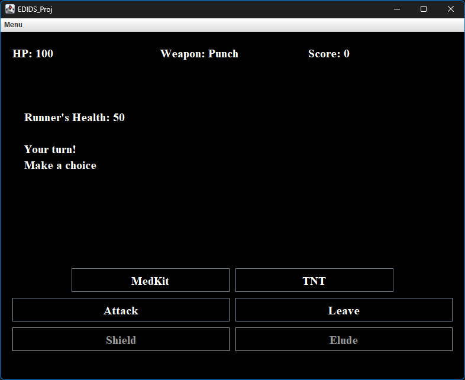
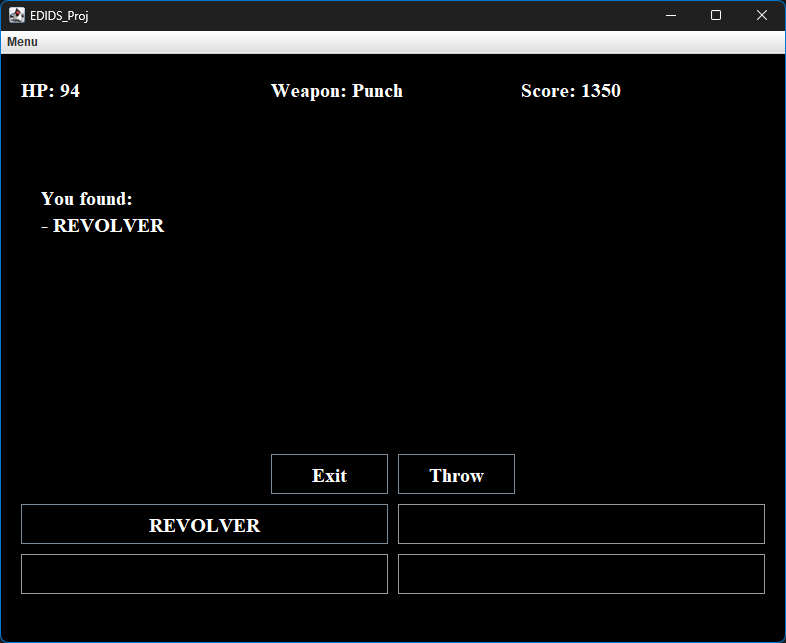

# Extraction Manual

# Index
- [Project Description and Implementation](#project-description-and-implementation)
- [How to Play Extraction](#how-to-play-extraction)
- [Cloning This Repository](#cloning-this-repository)
- [Technologies Used in This Project](#technologies-used-in-this-project)
- [Dependencies](#dependencies)
- [IDE](#ide)
- [Executables and Platforms](#executables-and-platforms)
- [Saved Files](#saved-files)


## Project Description and Implementation
During the initial stages of the project, we discussed the plot and specifications of the game. Once the specification and design phases were completed, we began developing the game, dividing the tasks but working in sync. Our goal was to create a simple role-playing game (RPG), based on a pre-existing game, that would allow the player to explore a building full of enemies with the ultimate goal of saving a hostage.

---

## How to play Extraction

When you start the game, this window appears:


Here you have two options: you can click start and begin a new game or you can load a saved game. If you chose the second option, you will see a list of your saved files:



After clicking the desired file, the game starts, and you will see this window:


Here you can visualize the map and move to North, South, East and West. If you have already visisted a room, a checkmark will appear over the room.

Everytime you move, a description of the room will appear on screen. This description includes
- Name of the room
- a short visual description
- eventual enemies or items

During the game, you can encounter three different types of Alien: Runner, Clicker and Shambler, and the fight window will be:



Here you have the options to:
- Attack: the damage depends on what weapon you have
- Leave the fight
- Protect yourself with a **Shielf** if you find one
- **Elude**: you can try to elude the enemy, but it's not always successful
- Heal yourself using the **Medikit** if you have one
- Throw a **TNT** to deal more damage

If you successfully won the battle, you will gain a **Score**.

Sometimes you will find some items inside the rooms: those items could be:
- A **weapon**
	- Revolver
	- AK47
	- USPSWORM
- A **key** to open the locked mate room
- **TNTs** to fight the enemies
- A **Shield** 
- A **Medikit**
- A **Torch** to access dark rooms



To win the game, the only way is to find the keys to open the room where the hostage is trapped and go back to the starting point, the **Extraction point**

---

## Cloning this repository


``` batch
git clone --branch master https://github.com/EDIDS/EDIDS_Proj.git
```

---

## Technologies used in this project

| Name       | Version | Description                                                                                                                       |
| ---------- |---------| --------------------------------------------------------------------------------------------------------------------------------- |
| Java       | 20      | Environment and programming language used to develop the application.                                                             |
| Java swing | 2.3.1   | A Graphic User Interface (GUI) widget toolkit for Java                                                                            |
| JUnit      | 5.10.2  | Framework for automated testing of Java classes                                                                                   |
| Amazon S3  |         | An Amazon service used to store our data into an Amazon Bucket                                                                    |
| Gson       | 2.11.0  | Gson is a Java library that can be used to convert Java Objects into their JSON representation. It's used to save or load a game. |

---

## IDE

This project was developed entirely in JetBrain's **IntelliJ IDEA 2024**.

If you want to clone this repository and take a look at the code we strongly suggest to use the same IDE as the
repository already contains all the configuration files to run gradle scripts.

---

### AmazonAWS connection
This apllication saves and loads the games into an Amazon S3 bucket. 

The connection works by using two keys related to the admin of that bucket or eventually the other member that have access to it.

In this project we decided to use the official toolkit from Amazon to make it possible. This plugin automatically creates a local config file under an hidden folder named .aws in your root directory, which is obviously not uploaded on GitHub for security reasons.

So, when the admin gives your access and secret key, you have to paste them inside this file after

[default]
aws_access_key_id = [YOUR ACCESS KEY]
aws_secret_access_key = [YOUR SECRET KEY]

Once this is done, the connection to the bucket will be successful.

---

## Saved files

The Extraction game includes a **save** features that allows the player to export all the current game data to a ```.json``` file. In this way a game can be resumed at any time and even on a different computer.

Any alteration of the exported files may result in unwanted behaviour or sometimes even complete crashes of the application.

